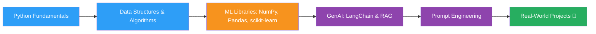
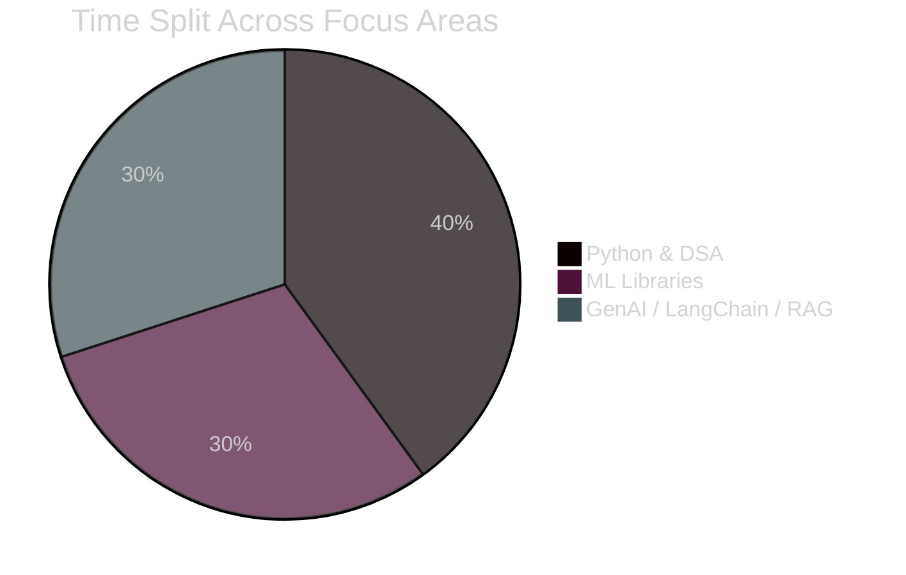

<div align="center">


</div>

<div align="center">

<!-- Badge buttons -->
<a href="https://www.linkedin.com/in/rishabh-mishra-283378385" target="_blank">
  
</a>
<a href="#-projects" >
  
</a>
<a href="#-connect-with-me">
  
</a>

<br/>


</div>

---

## 👨‍💻 About Me

<table>
<tr>
<td width="60%" valign="top">

```yaml
name: Rishabh Mishra
role: Computer Science Student
interests:
  - Python & Data Structures / Algorithms
  - Machine Learning (NumPy, Pandas, scikit-learn)
  - Generative AI (LangChain, RAG, Prompt Engineering)
currently: Learning & building — projects coming soon 🚧
```

- 🎓 Currently a student, sharpening my fundamentals in **Python** and **Data Structures & Algorithms**
- 🤖 Learning the **Machine Learning** stack — NumPy, Pandas, and scikit-learn
- 🧠 Actively exploring **Generative AI** — LangChain, RAG pipelines, and prompt engineering
- 🌱 Early in my journey — this profile will grow as my project list does
- 📫 Reach me on [LinkedIn](https://www.linkedin.com/in/rishabh-mishra-283378385)

</td>
<td width="40%" valign="top" align="center">


</td>
</tr>
</table>

---

## 🛠️ Tech Stack & Tools

<div align="center">


</div>

<br/>

<div align="center">

<table>
<tr>
<td align="center" width="33%">

### 🐍 Languages
<br/>


</td>
<td align="center" width="33%">

### 📊 ML Stack
<br/>
<br/>


</td>
<td align="center" width="33%">

### 🧠 GenAI Stack
<br/>
<br/>


</td>
</tr>
</table>

</div>

---

## 📊 GitHub Stats & Activity

<div align="center">


<br/>


<br/>


<br/>


</div>

> ⚠️ Note: These are auto-generated widgets from `github-readme-stats` / `github-profile-trophy`. They'll fill in as you push commits, star repos, and open PRs — the account is brand new, so expect them to look sparse for now. That's expected, not a bug.

---

## 🗺️ Learning Roadmap



## 📈 Skill Confidence (Self-Rated)



---

## 🚧 Projects

<div align="center">

<a href="#">
  
</a>
<a href="#">
  
</a>

</div>

| Project | Description | Tech | Status |
|---|---|---|---|
| _Coming soon_ | — | — | 🔜 Planned |

> This table gets updated the moment real projects are pushed — no placeholders pretending to be finished work.

---

## 📈 Contribution Snake

<div align="center">


</div>

> Needs a one-time GitHub Action added to your profile repo to render (steps available on request).

---

## 🤝 Connect With Me

<div align="center">

<a href="https://www.linkedin.com/in/rishabh-mishra-283378385" target="_blank">
  
</a>
<a href="https://github.com/rishabhmishra4572" target="_blank">
  
</a>

<br/><br/>


</div>

---

<div align="center">

<i>⭐️ This README is a work in progress, just like the journey it represents.</i>
</div>
