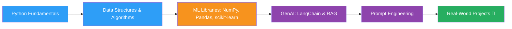

<h1 align="center">Hi there, I'm Rishabh Mishra 👋</h1>
<h3 align="center">CS Student • Exploring Python, Machine Learning & Generative AI</h3>

<p align="center">
  
</p>

<p align="center">
  <a href="https://www.linkedin.com/in/rishabh-mishra-283378385" target="_blank">
    
  </a>
  
  
</p>

---

## 👨‍💻 About Me

```yaml
name: Rishabh Mishra
role: Computer Science Student
interests:
  - Python & Data Structures / Algorithms
  - Machine Learning (NumPy, Pandas, scikit-learn)
  - Generative AI (LangChain, RAG, Prompt Engineering)
currently: Learning & building — projects coming soon 🚧
```

- 🎓 Currently a student, sharpening my fundamentals in **Python** and **Data Structures & Algorithms**
- 🤖 Learning the **Machine Learning** stack — NumPy, Pandas, and scikit-learn
- 🧠 Actively exploring **Generative AI** — LangChain, RAG pipelines, and prompt engineering
- 🌱 Early in my journey — this profile will grow as my project list does
- 📫 Reach me on [LinkedIn](https://www.linkedin.com/in/rishabh-mishra-283378385)

---

## 🛠️ Tech Stack & Tools

<p align="left">
  
</p>

<table>
<tr>
<td valign="top" width="33%">

**Languages**
- Python
- (DSA fundamentals)

</td>
<td valign="top" width="33%">

**ML Stack**
- NumPy
- Pandas
- scikit-learn

</td>
<td valign="top" width="33%">

**GenAI Stack**
- LangChain
- RAG (Retrieval-Augmented Generation)
- Prompt Engineering

</td>
</tr>
</table>

---

## 📊 GitHub Stats

<p align="center">
  
  
</p>

<p align="center">
  
</p>

<p align="center">
  
</p>

> ⚠️ Note: These are auto-generated widgets from `github-readme-stats`. They'll fill in with real activity as you push commits, star repos, and open PRs — right now the account is brand new, so they may look sparse for a bit. That's expected, not a bug.

---

## 🗺️ Learning Roadmap



---

## 🚧 Projects

> Projects are on the way — this section will be updated as they're built and pushed.

| Project | Description | Tech | Status |
|---|---|---|---|
| _Coming soon_ | — | — | 🔜 Planned |

---

## 📈 Contribution Snake

<p align="center">
  
</p>

> This snake animation requires a one-time GitHub Action setup in your profile repo (steps below). It renders your contribution graph as an animated snake.

---

## 🤝 Connect With Me

<p align="center">
  <a href="https://www.linkedin.com/in/rishabh-mishra-283378385" target="_blank">
    
  </a>
</p>

<p align="center">
  
</p>

---

<p align="center"><i>⭐️ This README is a work in progress, just like the journey it represents.</i></p>
